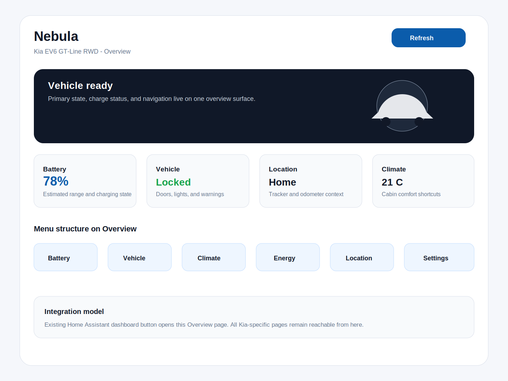
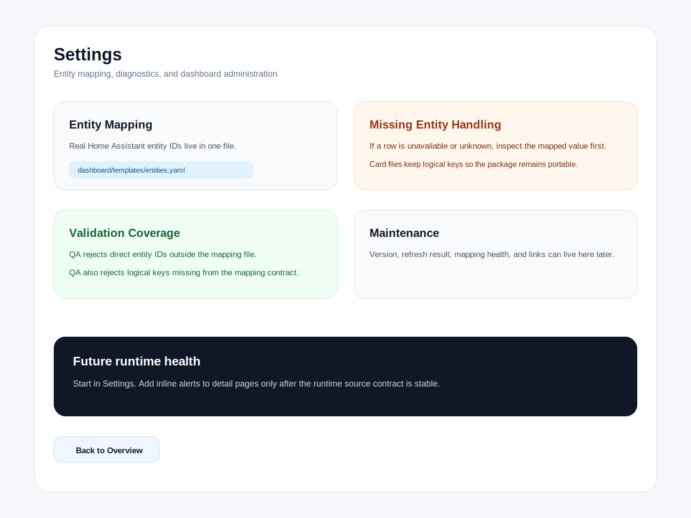
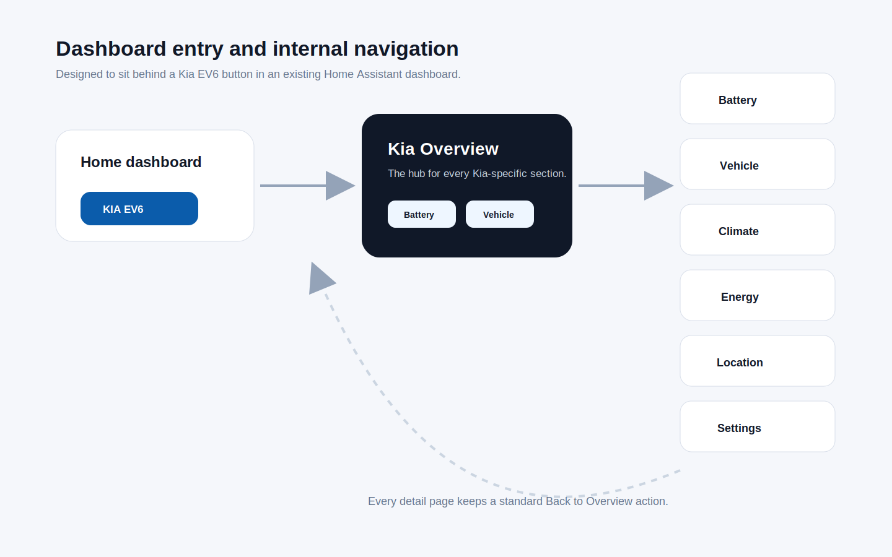

# Screenshot References

These SVG renders are visual references for the dashboard direction. They are not
pixel-perfect Home Assistant screenshots yet; they document layout intent for
review while the Lovelace package is still being assembled.

## Renders

## Usage

- Use these renders when reviewing layout direction in pull requests.
- Keep renders in sync when navigation, diagnostics, or page composition changes.
- Replace or supplement these references with real Home Assistant screenshots
  once the dashboard is installed in a test instance.
